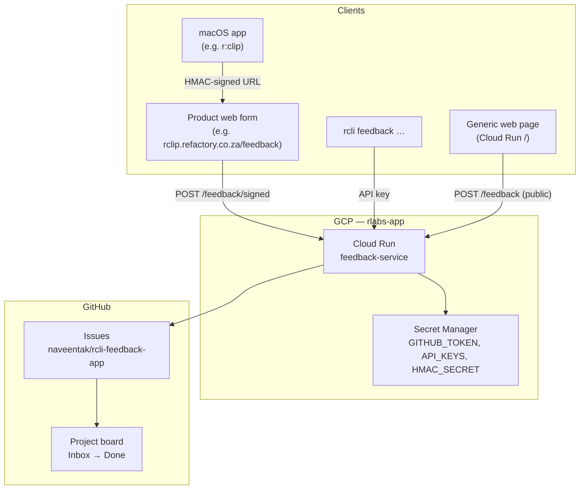

# Architecture

## Principle

**GitHub Issues is the only source of truth.** No application database. The feedback service is a thin API gateway; `rcli` is the operator interface.

## System diagram

## Components

| Component | Repo | Role |
|-----------|------|------|
| Feedback service | `rcli-feedback-app` | Go + Gin HTTP API; creates/manages GitHub Issues |
| `rcli` CLI | `rcli-feedback-app` | Operator tool: list, triage, comment, agent context |
| Product web form | Per-app (e.g. `rclip-webapp`) | Branded UX; POSTs to signed endpoint |
| macOS opener | Per-app (e.g. `rclip-macos-app`) | Generates HMAC URL; opens browser |
| GitHub Issues | `naveentak/rcli-feedback-app` | Persistent ticket store |
| GitHub Projects | GitHub UI | Kanban workflow |

## Submission paths

### Path A — Signed web form (macOS utility apps) ✅ r:clip

Used when the product has a **polished web form** and the macOS app should not embed API keys.

1. macOS app signs `{deviceId}|{timestamp}` with shared HMAC secret
2. Opens `{product}.refactory.co.za/feedback?did&ts&sig&app&type&v&os`
3. Web form POSTs to `/api/v1/feedback/signed`
4. Service validates HMAC (1-hour window) → creates GitHub Issue

### Path B — API key (CLI, server-side, future mobile)

Direct `POST /api/v1/feedback` with `X-API-Key` + `X-App` headers.

### Path C — Public submit (generic page)

`POST /api/v1/feedback` without auth when `PUBLIC_SUBMIT=true`. Used by the generic Cloud Run landing page only.

## GitHub labelling

Every issue is tagged automatically:

| Label prefix | Example | Set by |
|--------------|---------|--------|
| `source:` | `source:rclip` | App ID on submit |
| `type:` | `type:bug`, `type:feature-request` | Ticket type |
| `status:` | `status:triaged`, `status:in-progress`, `status:done` | `rcli feedback update` |

Open issues without a `status:` label are treated as **Inbox**.

## Security model

| Auth | Who | Can do |
|------|-----|--------|
| HMAC signed URL | macOS app users | Submit only, via web form |
| API key per app | CLI / integrated apps | Submit, comment, update status |
| None | Public | Read issues, generic page submit (if enabled) |
| GitHub token | Service only | Create/edit issues (server-side) |

## Non-goals

- User accounts / login
- In-app native forms (unless a product explicitly needs offline-first)
- Local database or Supabase tickets table
- Email notifications (future; use GitHub notifications for now)